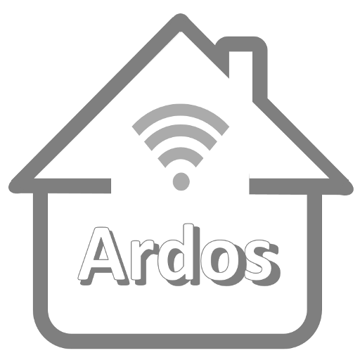
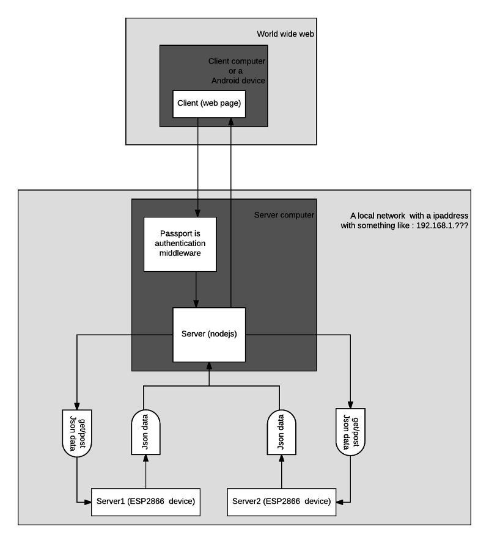

# VoffCon


  [Readme](https://guttih.github.io/voffcon) | [Device setup](https://guttih.github.com/voffcon/docs/device-setup.html) | [YouTube channel](https://www.youtube.com/channel/UCmZFs6SCoeuphnKucBkvcEg)
:-------------------------:|:-------------------------:|:-------------------------:
<br/>

VoffCon is a system for controlling devices and appliances from anywere.  It is made up by two components.  A node server and A device server.  The main benefits of this system is your ability to create your own controls and cards, which other users logged in to your system can use to control devices you deside to put on your cards.

## Intoduction

<div style="text-align:center">
  <a href="http://www.youtube.com/watch?feature=player_embedded&v=zGagaUuTqe0
  " target="_blank"></a>
</div>

## The node server
Is a server created with node.js.  This server creates webpages which can be viewed in a web browser like Google Chrome, Microsoft Edge and Internet Explorer. If you portforward the server out to the internet you will be able to accsess your devices from anywhere.  It uses the  [Passport](http://passportjs.org/docs) authentication middleware to keep your devices from being controlled by everyone. 
The server provides connections to many devices and uses passport to make sure that the user is authenticated before he is able to give commands to the server running on the devices.

## The basics for the node server
### Overview
This application is a server intended to run on a computer where it can access the esp8266 and esp32 devices which run running a special server program which was developed for this server in mind.
<div style="text-align:center">
  
</div>

### requirements:
You will need to install the following if you haven't already.
+ [MongoDb](https://www.mongodb.com) To store users cards, controls and device information. ([Install tutorials](https://docs.mongodb.com/manual/installation/) or [installing with package manager](https://nodejs.org/en/download/package-manager/#debian-and-ubuntu-based-linux-distributions) ) 
+ [Node.js](https://nodejs.org/en/) To run the Node server
+ [Arduino IDE](https://www.arduino.cc/en/Main/Software)  To program the devices.  ( [Video tutorial for windows](https://youtu.be/6uPTaGaAUjk) )
+ **Device Core** libraries for the device servers running on the two devices listed below. ([Install instructions](docs/device-setup.md))
    - *ESP32 Development Module* will need the [ESP32 Arduino Core](https://github.com/espressif/arduino-esp32)   ( [Video tutorial](https://youtu.be/4gLXqaICsvQ) )
    - *NodeMCU 1.0 (ESP-12E Module)* will need the [ESP8266 core for Arduino](https://github.com/esp8266/Arduino) ( [Video tutorial](https://youtu.be/hQYEQ4Hrih8) )
    
## Getting up and running
### Run the mongodb server
#### Windows
##### Install MongoDb
If MongoDb is not installed you will need to install it.  See this instructions how to do that [here](https://docs.mongodb.com/manual/installation/).

Use windows file explorer to:
- Create the folders "C:\data" and "C:\data\db". 
- Then Run the mongo server by Double-clicking on the file  ```"C:\Program Files\MongoDB\Server\3.4\bin\mongod.exe“ ```.

Or just use the windows command shell, by typing the following commands.
```shell
"C:\Program Files\MongoDB\mongod.exe"
```

#### Linux

##### Rasbian
Please see this [video tutorial](https://youtu.be/_s6m6bRXeGA) on how install VoffCon on Raspbian

how to run mongodb on run on linux
```shell
mongod
```
#### Installing VoffCon on Ubuntu 16.04 (Linux) when all prerequisites are missing
Assuming that you do not have Mongodb, nodejs or npm installed.  This would be the process you would follow.

##### Reload local package database
```shell
sudo apt-get update

```

##### Install the MongoDB packages.
```shell
echo "deb http://repo.mongodb.org/apt/ubuntu xenial/mongodb-org/3.2 multiverse" | sudo tee /etc/apt/sources.list.d/mongodb-org-3.2.list
sudo apt-get install -y mongodb-org
# Create dir to store data and run mongodb
sudo mkdir /data
sudo mkdir /data/db
sudo mongod
```
##### Install nodejs
```shell
sudo apt-get install -y nodejs
sudo apt install npm

```

##### Install packages which the VoffCon app server uses and running the server
```shell
npm install
node voffcon

```
And the go to a modern web browser and visit the url [http://localhost:6100](http://localhost:6100) to see VoffCon running.
## Devices

| Device                | Description    |
:-------------------------:|:-------------------------:|
  | NodeMcu Developement Module with ESP8266 is a pretty powerful device compared with the Arduino.  it has a on board WiFi, allowing you to control it with a web-brower or a phone.  It is a small and cheap device which allows you to control real world devices and appliances via a WiFi connection.  A device server needs to be uploaded to this device so the Node server and the Device can comunicate.               |
 | Esp32 Is the next version of the Esp8266 module.  This dual-processor development board has also WiFi on board.  Additionally it has Bluetooth and is more powerful than the Esp8266.  It is also a small and cheap device which allows you to control real world devices and appliances via a WiFi connection.  A device server needs to be uploaded to this device so the Node server and the Device can comunicate. |


## Setting up the device server
[Click here](docs/device-setup.md) to get instructions on how to setup the device server.


### More about the system
#### Users
There are three kinds of users (actors). "administrator", "power user/card creator" and a "normal user".

##### Administrator
Has the power to change/modify or delete all cards, and devices. He can also give a user access to a card, or a device, just like a card creator. This user is the only one who can upgrade, downgrade or delete users. He can f.example change a normal user to "administrator" or a "power user". He can also change a power user back to a normal user. He has total control of everything.


##### Power user 
Is a person who is able to change or create cards or devices. He needs to know how to upload programs to the devices. He needs to know what a subnet is and basic information about networking. He needs to have access to the routers so he can setup IP addresses for the devices. He is the one who will be adding the available devices for everybody. This person will also be creating control-cards. A power user will become a Card creator when he has created a Card or has been given access to change a card.

##### Card creator
A card creator is a power user which has created a control card. He has the power to grant others access to his card. He can grant a normal user access to his card and that will allow the normal user to use his card. The normal user will also be able to press or view controls on his card. A card creator can also grant another power user to have a card creator privileges for his card. 

##### User (normal user)
He knows how to use a browser and he also has recived information from the power user on how the control-cards work. He knows what the cards control and Do's and Don'ts about a device he Is able to control using the control-cards. All knowledge about the control-cards should be supplied by the power user. 

#### Control card
A control card is a web-page which the normal user works with. On this card there are buttons or controls which allow the user to change or view the state of the different devices. One card can include controls for many devices. 
This control card is created by a power user. The creator of the card will also be the one who will give other users access to a card. By default only the user which created the card will have access to the card he created. The creator user can select any user and grant him an access to his card. The card creator is the only one who can modify it(with the exeption of the Administrator). He can grant other power user access to his card giving them the card-creator privileges. No other power user can access his card without the card-creator’s permission.

#### Control
A Control is a control class which can be used when creating a card.  These Controls can be thought of as a library.  One control could be f.example DiodeCtrl.  DiodeCtrl could be a class which shows an image of a diode which a Card creator can use to display a pins values as a diode.  Another control could be a slider which allows the Card creator to provide the user an easy control of a pins value by allowing the user to drag a button on a slider around to change a device pin value.  The same user access rules apply to Control as where described in the Control Card section above. 

#### Access to devices
If a user wants to access a device then the system will grant him access if the user is a power user. The system will only give a normal user access to a device through a control card that controls the device.

### Later additions to the system / nice to have
- Create a visual/drag'n drop editor, allowing power users create cards more easier.
- Create a visual/drag'n drop editor, allowing power users create controls more easier.
- Show running cards without the VoffCon menu.


# Licence  
        VoffCon is a system for controlling devices and appliances from anywhere.
        It consists of two programs.  A “node server” and a “device server”.
        Copyright (C) 2016  Gudjon Holm Sigurdsson

        This program is free software: you can redistribute it and/or modify
        it under the terms of the GNU General Public License as published by
        the Free Software Foundation, version 3 of the License.

        This program is distributed in the hope that it will be useful,
        but WITHOUT ANY WARRANTY; without even the implied warranty of
        MERCHANTABILITY or FITNESS FOR A PARTICULAR PURPOSE.  See the
        GNU General Public License for more details.

        You should have received a copy of the GNU General Public License
        along with this program.  If not, see <http://www.gnu.org/licenses/>.
        
[Click here](/public/COPYING.txt) for a copy of the licence.

You can contact the author by sending email to gudjonholm@gmail.com or 
by regular post to the address Haseyla 27, 260 Reykjanesbar, Iceland.

