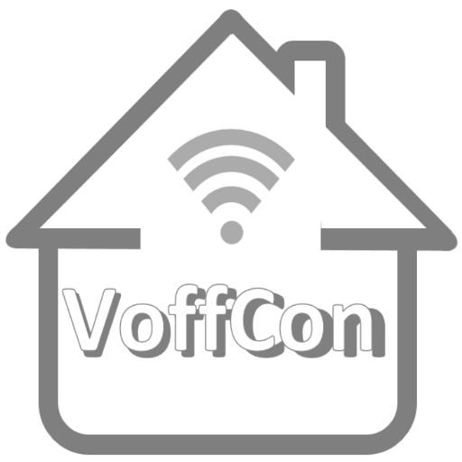
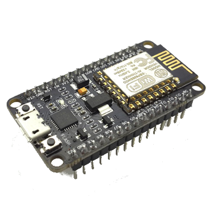
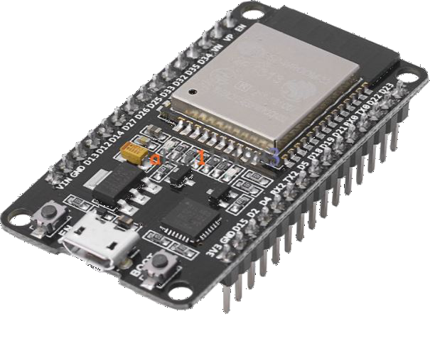

# VoffCon - How to setup the devices 


 [Readme](https://guttih.github.io/voffcon) [Device setup](https://guttih.github.com/voffcon/docs/device-setup.html) 

 Description on how to setup these two devices
 - The **NodeMCU 1.0 (ESP-12E Module)** which has the Esp8266 wifi chip on board.
 - The **ESP32 DEV Module** which has the Esp32 Wifi and bluetooth chip on board.

<div style="text-align:center">
 
 <div width="100"> </div>
 
</div>

## Why we need to setup a device
In order to be able to communicate with the device using VoffCon, you will need to setup your computer so you can use it to send a program to the device.  This program is called the Device server.  The device server will allow the Node server to view and change values on the device it self.  To get the device server onto the device you will need to follow the instructions below.  

## create the file config.json
If there is no file called config.json in the root of the Arduino project, then you will need to create it.  After that you should provide a ssid and a ssid password.  ssid is the name of your whifi network.  the ssid is the password needed to connect to that network.  These are the same values you need to connect your smart mobile phone to your wifi. These values will be used by the node server to create the program (the device server) which will be uploaded to your device.

#### config.json
```json
{"port":6100,
"allowUserRegistration":true,
"ssid":"nameOfYourWifi",
"ssidPwd":"passwordToYourWifi"}
```

## Install the Arduino IDE
- [Click here](https://www.arduino.cc/en/Main/Software), download the Arduino Software and install it.

### ESP32 Arduino Core
If you will be using the ESP32 Development Module you will need the ESP32 Arduino Core.  

### Installing the esp32 core for Arduino
 1. Open the Arduino IDE
 2. Open the preferences window, go to File > Preferences
 3. Enter `https://dl.espressif.com/dl/package_esp32_index.json` into Additional Board Manager URLs field.
    - note, if you already have a path there, add a comma and a single space behind the last path and then add the path.
 4. Click “OK” button
 5. select from menu > Tools > Board: "Arduino/Genuino Uno" > Boards Manager...
 6. type esp32 into the text box to find the "esp8266 by ESP8266 Community" click it and press the "install" button.
 7. select from menu > Tools > Board: "Arduino/Genuino Uno" > NodeMCU 1.0 (ESP-12E Module).
 8. now you can have fun with a lot of examples for the ESP8266 in File > Examples > ESP8266*
#### Tutorial
Click [click](https://randomnerdtutorials.com/installing-the-esp32-board-in-arduino-ide-windows-instructions/) to view a good tutorial. 

##### The old method
[Click here](https://learn.sparkfun.com/tutorials/esp32-thing-hookup-guide/installing-the-esp32-arduino-core) to get information on how get the ESP32 Arduino Core.
- Follow them to install the Core.

## ESP8266 core for Arduino
If you will be using the NodeMCU 1.0 (ESP-12E Module) you will need the ESP8266 Arduino Core.

"Esp8266 by [ESP8266 community](https://github.com/esp8266)" is the [library](https://github.com/esp8266/Arduino/tree/633e48f3aec5f1c3c11d4498fc90d378d49e6e9f/libraries/ESP8266WiFi/src) I used to write the Device server.  You will need to install it.  Easiest way to do that is to use the Arduino IDE Board manager.

### Installing the ESP8266 core for Arduino
 1. Open the Arduino IDE
 2. Open the preferences window, go to File > Preferences
 3. Enter `http://arduino.esp8266.com/stable/package_esp8266com_index.json` into Additional Board Manager URLs field.
     - note, if you already have a path there, add a comma and a single behind the last path and then add the path.
 4. Click “OK” button
 5. select from menu > Tools > Board: "Arduino/Genuino Uno" > Boards Manager...
 6. type 82 into the text box to find the "esp8266 by ESP8266 Community" click it and press the "install" button.
 7. select from menu > Tools > Board: "Arduino/Genuino Uno" > NodeMCU 1.0 (ESP-12E Module).
 8. now you can have fun with a lot of examples for the ESP8266 in File > Examples > ESP8266*

Now we should be able to send our device server program to the device via a usb port. 

## Programming the device
We will need to send the Device server program to the device.  We can do that by doing the following
 1. Browse to the the VoffCon system.
 2. Create a device, by going to menu -> Devices ->  Register a new device.
 3. Save the device, to add it to the VoffCon database.
 4. Press the "> Run" button and click the "Get program" button.
 5. Save the program to you local hard disk. 
 6. Open the Arduino IDE.
 7. Select the device you will be programming
    - for **NodeMCU 1.0** select from menu > Tools > Board: "Arduino/Genuino Uno" > NodeMCU 1.0 (ESP-12E Module).
    - for **ESP32 DEV Module** select from menu > Tools > Board: "Arduino/Genuino Uno" > ESP32 DEV Module
 8. Connect the device to your computer using a USB cable.
 9. Select the COM port the device is connected to.
 10. Select from the menu File -> New to create a new sketch.
 11. Open the .ino program you downloaded.
 12. Copy all text in the downloaded file and paste it into the new sketch in the arduino IDE.
 13. If VoffCon Node server has not automaticly changed the values below for you in the device server program, you will need to change them manually.
 ```
       IPV4_IPADDRESS  : (IP) Provide an ip address (IPV4) which you want the device to ask operating system for.
       PORT_NUMBER     : (Port) Provide the port number you want the device to listen and serve from.
       IPV4_GATEWAY    : (Default Gateway) The device needs to know the default gateway it will be using.
       IPV4_SUBNET     : (Subnet mask / netmask) The subnet mask it is on.
       WIFI_ACCESSPOINT: (SSID) Service set identifier of the wifi network the device will be connecting to.
       WIFI_PASSWORD   : (SSID password) The password to your wifi network. 
```       
 15. Compile, build and send the Device Server program to the device.
  
  Now the device has been setup and you should be able to connect to it.


## The Device server

### General information
As noted above this program needs to be uploaded on the device you want to control from the node server.
This server will only allow request to it, if the request comes from a client which is on the same subnet. In fact the Device server will check for the first 3 numbers in the calling ip address and if all 3 match the device ip address numbers then the caller will be considered as save and his requests will be acted upon.  Exeptions to this can be made by whitelisting specific ip addresses.


### Device server commands
These are possible commands a client (the Node server) can send to the device.

- /pins
  - __get__ Get status of all pins
  - __post__ Change the value of a pin, that is, turn off or on or set a pins value from 0 - 1023
- /whitelist
   - __get__ Get all whitelisted ip addresses
  - __post__ Add a new ip address to the whitelist
  - __delete__ Remove a existing ip address from the whitelist
- /started
    - __get__ Get when the server was turned on
- /status
    - __get__ Get the status of the pins, whitelist and when the server was started, all in one request.  (good for beginning of a page)
- /setup
  - __get__ whitelists the first caller to the device.  (todo: this is a sequrity risk, should be removed after development)
- /pinout
  - __get__ returns the pin mappings of the device.  That is f.example "D0" on the device is mapped to the pin number 16.
  - /monitors
  - __get__ returns all the pin monitors which monitor pin values and if a cetain time has passed.
  - __post__ Updates the monitor list with monitors from the Json object provided in the body.
  - __delete__ Deletes list items provided by from Json array

### Device server Documentation
#### NodeMcu
Here are all the [classes](http://voffcon.com/docs/hardware/nodeMcuDocs/html/annotated.html) you have access to from the [NodeMcu VoffCon device server](https://github.com/guttih/voffcon/blob/master/hardware/DeviceServerNodeMcu.ino).
In the node server is a variable called server which is of the type [ESP8266WebServer](https://links2004.github.io/Arduino/d3/d58/class_e_s_p8266_web_server.html)

See also:
  - [esp8266 documentation](http://esp8266.github.io/Arduino/versions/2.2.0/doc/libraries.html) from the ESP8266 Community libraries.
  - [ESP8266 Class libary](https://links2004.github.io/Arduino/annotated.html) from the [ESP8266 core](https://github.com/esp8266/Arduino)

#### Esp32
Here are all the [classes](http://voffcon.com/docs/hardware/esp32Docs/html/annotated.html) you have access to from the [Esp32 device server](https://github.com/guttih/voffcon/blob/master/hardware/DeviceServerEsp32.ino).
 The esp32 device server is built using [Arduino-esp32](https://github.com/espressif/arduino-esp32) which is intended to provide an arduino compatible environment on the esp32 hardware. The basic arduino functional documentation can be found [here](https://www.arduino.cc/reference/en/).
 
